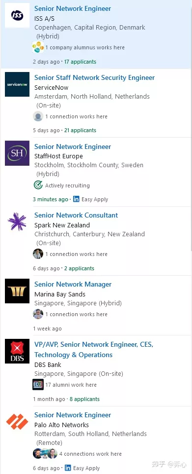
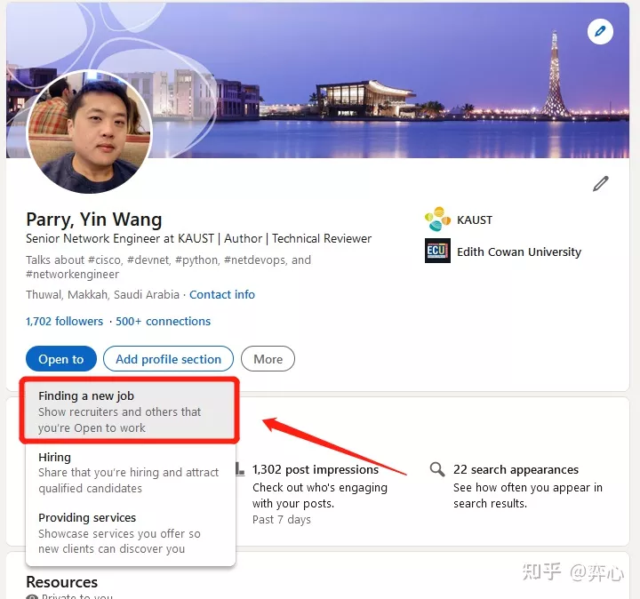
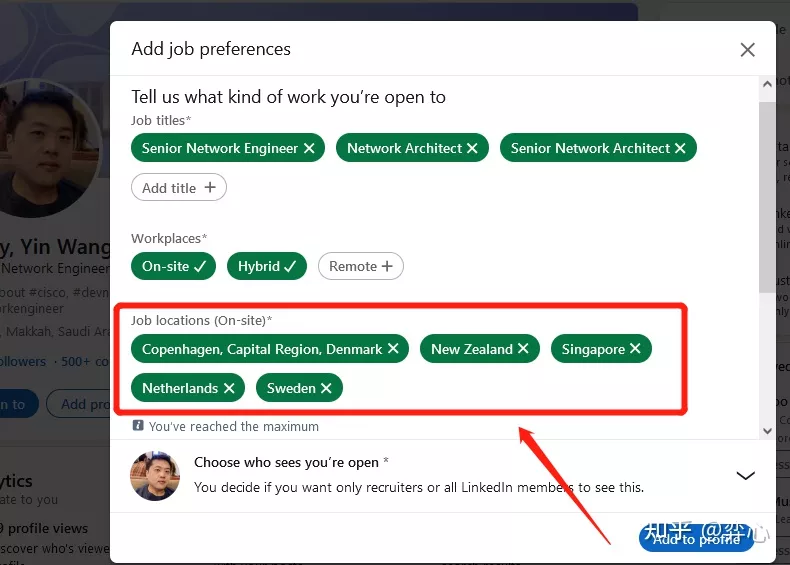

- - - -
title: 网工润学指南1.3版
subtitle: 

# Summary for listings and search engines
summary: Welcome 👋 We know that first impressions are important, so we've populated your new site with some initial content to help you get familiar with everything in no time.

# Link this post with a project
projects: []

# Date published
date: '2023-1-9T00:00:00Z'

# Date updated
lastmod: '2023-1-9T00:00:00Z'

# Is this an unpublished draft?
draft: false

# Show this page in the Featured widget?
featured: false

# Featured image
# Place an image named `featured.jpg/png` in this page's folder and customize its options here.
image:
caption: 'Image credit: [*Unsplash*](https://unsplash.com/photos/CpkOjOcXdUY)'
focal_point: ''
placement: 2
preview_only: false

authors:
* admin

tags:
* 润学

categories:
* 润学
- - - -
作为出国18年（新加坡12年，沙特6年)，走过57国有13年海外工作经验的seasoned network engineer，就我从2017年上知乎来这五年对国内计算机网络、网络工程师等相关话题下所有帖子的观察，国内的网工不管是从薪资待遇、工作强度（加班强度、是否996、出差是否频繁、每年带薪年假多少天、休假期间是否也被要求手机畅通、笔记本电脑放在身边待命）、受尊重程度（包括是否有学历歧视、跳槽歧视、年龄歧视、35岁中年危机等）来说都不算太理想。另外国内网上我看到的更多的是嘲讽、贬低、劝退这个行业以及同行的帖子，动不动就说什么网工就是拉网线、搬砖的，什么“CCIE烂大街了，我遇到一个paper IE，连console线是什么都不知道”（这种IE有是有但毕竟是少数，他们有些只是在找第一份工作，还没有实操经验罢了，我认为没有必要举这种例子来提高自身的“优越感”），真正虚心讨论技术、分享干货的是少数。**给我的总体印象是国内这行负面的东西多过正面的，有一股莫名的“戾气”围绕其周围，也许这就是内卷太过严重的产物吧。**
这几年找我咨询出国做网工的粉丝、读者很多，今天闲来无事，先整理一下，以后会根据情况更新。
1. CCIE必备，首选RS（也就是现在的EI），其他任何IE不用考虑，不要对华为、华三之类的认证抱有幻想，不用浪费时间和精力。
2. 英语水平以雅思成绩为参考，阅读是中国人最容易突破的，口语、听力至少6.5分以上，口语难度最大，这个建议找母语为英语的外教一对一练（别舍不得那点钱，想想你在考IE、学各种技能时给培训班交成千上万的学费时都那么痛快），另外自己也针对性的在油管上去找network engineer interview的视频，知道网工的技术面一般会问些什么问题，专业术语怎么说，适应一下印度人的口语（如果面试你的人是印度人），有针对性的练习，国内80%以上技术很不错的网工都是栽在英语面试上，这个必须下功夫。写作的话等润出去后在工作中跟母语为英语的同事老板学，跟着他们的邮件反复、坚持揣摩模仿，套用在自己的写作中。
3. 准备一套英语简历，可以请专业人士帮你修改润色。
4. 领英用国际版，其他的indeed, seek, monster, glassdoor, efinancialcareers (专注fintech领域的求职网站）都注册个号用起来。
5. 不管是朋友介绍还是公司外派（第一世界国家），抓住身边所有能润出去的机会（第一世界国家之外的不用考虑），记住感恩。
6. 如果没有猎头找你，没有朋友内推，没有公司外派的机会，可以走留学这条路，以你在国内拼搏吃苦的那个劲，毕业之前找份工作留下来不是难事。
7. 对网工来说，新加坡是个不错的跳板，很锻炼人，第一世界国家里内卷程度最接近国内的，好处是网工工作机会超多，个税低。拿到新加坡PR或者公民后（2-6年时间）可以考虑留下来或者往澳洲、新西兰、北美润，欧洲的话首选爱尔兰。
8. 有了PR后，以收入为导向勤跳槽，谨记我说过的“网工这行拉开收入差距的不是技术，而是平台”这句真理。
9. 如果你想以网工的身份早点实现财务自由并且将来想落叶归根，可以考虑不接受移民但是高收入、不收个税、工作生活平衡有保障的中东，但切记避开中资企业。
10. 年龄越年轻越好，接近或者刚到不惑之年的也可以尝试，如果是知天命的话就算了（毕竟你都“知天命”了）。
11. 学历至少专科，但是保险起见还是要本科（是不是成人自考无所谓），国外有些给得起钱的工作需要bachelor degree。985、211的学历对润没帮助（当然证明你学习能力强是好事），除非中资企业，不过中资企业不是你润出去的目标。
12. 润中东的话，首选阿联酋的迪拜和阿布扎比，再次也要沙迦，其他几个酋长国不用考虑。沙特这几年搞Saudisation机会不多，卡塔尔、巴林、阿曼可以为备选，曾经达到过70度高温的科威特不用考虑。
13. 请善加利用netdevops红利期，国外会python的网工没有你们想象中那么多，这是润出来后对找高薪工作加成最高的技能。
14. 刚出去的时候先积累经验，多和猎头搞好关系，好的猎头能给你面试的tips（甚至直接透露面试官会问什么技术问题），帮你修改简历，倾听你的意见和想法，帮你物色更适合你的职位，甚至主动帮你争取到更好的薪水。
个人比较推荐的一些靠谱的总部不在新加坡，但是在新加坡有分部的猎头公司如下,公司规模有大有小（自己亲身接触过的）：
Robert Walters
Randstad
Henderson Scott
Morgan Mckinley
Hays
BAH Partners (香港的猎头公司，他们也有新加坡的客户）
EIRE Systems (也是香港的猎头公司，在新加坡有branch)
Evolution Recruitment Solutions
Huxley
Hamilton Barnes
15. 行行出状元，行行都有大牛。如果要以收入论成败的话（尤指税后收入），网工的出路肯定在国外。
以新加坡为例，10年以上工作经验的顶级网工（纯技术，非管理层）税后年入130-160万rmb+是有的，我当年在苹果公司（新加坡）就认识3个收入在这个区间的同行，这得益于新加坡个税很低（税前100万的话，到手是有90万的），而且政府有很多个税减免政策的优惠，当然这里说的是顶级网工在新加坡的收入，大部分10年以上工作经验的网工收入还停留在年入9万-18万新币(45万-90万rmb)之间。这个收入在新加坡过的还是比较滋润的，除了车太贵外，政府组屋靠自己还是随便买得起的（想想国内一线城市的网工要想不啃老买套房是什么难度。）公寓干几年也是能入手的。大部分我认识漂在新加坡的网工都是在这边买了房子定居下来并且换了国籍的，毕竟新加坡教育环境对小孩还算不错，护照也很好用。还有一小部分干了几年去了澳洲，加拿大，回国的比较少。
顶级网工在中东收入更多，第12条提到的那几个中东土豪国都不收个税，不收个税，不收个税。不过这边网工的工作机会不如新加坡那么多，给的起钱的公司也没有想象中那么多，以沙特为例，阿美石油，我所在的KAUST, 以及个别国家级项目，比如沙特前几年斥资5000亿美元打造的跨国未来超级城项目NEOM是会砸重金招人的，其他公司比如沙特最大的运营商STC也会常年在中国、香港、东南亚招网工，待遇一般在2.5万-4万里亚尔（1里亚尔等于1.8人民币），都是税后收入，迪拜、阿布扎比、卡塔尔的话收入和沙特差不多。
沙特好处是生活很省钱，而且这个国家不接受移民（也没人想移民来这里），你来这边纯粹就是为了挣钱然后回国花，以120万年薪养一家三口一辆车为例，生活过的不奢侈的话，一年存下80万以上是轻轻松松的事，加上每年3%-10%的加薪，如果配偶在这边也有工作的话，15年的时间内实现家庭财富自由，然后45岁前提前回国退休是有可能的，大前提是中东大环境稳定，近几十年内不发生大规模战争。
北美的话，美加税收都太恐怖，虽然税前拿2、30万美刀甚至更多的网工大有人在，但是各种税扣完能拿到手60%以上就算很不错了，税后实际收入其实和中东比高不到哪去甚至还不如中东，当然计算机网络前沿的技术和行业话语权还掌握在美帝手里，适合在厂商里制定协议、做研发或者在高校搞科研的大牛发展，不过对国内绝大多数只有普通本科甚至专科文凭的网工来说还是老老实实找家公司做售前售后或者运维吧。
我自己前几年也和北欧的公司接触过，挪威、丹麦的公司给的税前薪水还是不错的，换算成人民币大概都在100万左右（挪威克朗这几年贬值厉害，估计只拿得到80-85万税前），但是扣完个税就只能呵呵了。不过北欧国家福利是真的好，国内税收其实也不低，在国内税前年入100万的话差不也要交近30万的稅，同样高税收，但是国内纳税人纳税后相应所得到的福利真的还和北欧国家差很远很远，当然国情不同，这么比有点不公平。
如果真要润欧洲的话其实可以考虑爱尔兰，都柏林是欧洲的IT产业中心，网工机会很多，而且这个国家在第一世界国家里算是相对很低调属于闷声发大财那种，各种社会福利也应有尽有，我读者里有两位已经润去那边的，反馈很不错。
16. 找工作的话推荐使用领英国际版，可以按自己喜欢的国家让领英有针对性地给你推送该国的网工职位（最多5个国家），比如我本人就关注了丹麦、荷兰、瑞典、新西兰、新加坡的职位，每天都会从领英收到推送的这些国家的网工职位：

17. 领英开启Job Locations的攻略如下：
进入领英个人页面，点击Open to:

2. 点击Finding a new job:

3. 此时即进入了Add job preferences，在下面的Job locations (On-site)*里添加自己感兴趣的国家或地区的职位，这样既可每天收到领英推送的该国职位：

